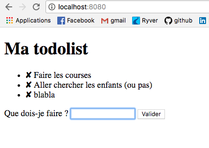

# nodeToDoList

## Une Todolist en temps réel avec node.js

- Une todolist en temps réel : c'est à dire que les différentes personnes qui se connectent voient directement lorsque quelqu'un rajoute ou enlève un évenement. 



1. Initialisez le fichier .json `npm init`

2. Installez les modules 
  - Express : `npm install express` -> Framework (super-bibliothèque). Permet de gérer entre-autre les routes(URL) et d'utiliser des         templates.
  - Http : `npm install http` -> permet de créer un serveur web. `require('http').createServer(app)`
  - Socket : `npm install socket.io` -> Bibliothèque qui permet de communiquer en temps réel.
  - Ent : `npm install ent` -> Permet de bloquer les caractères HTML.
  - Fs : `npm install fs` -> Permet de travailler avec le système de fichier. 
  - Ejs `npm install ejs` -> Template. Me permet de créer ma vue todo.ejs
  
 3. Lancer l'application
   - dans la console `node app.js`
   - dans votre navigateur `localhost:8080`
   
   
## Les fichiers

### App.js

```node
var express = require('express')
		app = express(),
    server = require('http').createServer(app),
    io = require('socket.io').listen(server),
    ent = require('ent'), // Permet de bloquer les caractères HTML (sécurité équivalente à htmlentities en PHP)
    fs = require('fs');

var tableauDonner = [];//mémorisation de la liste


// Chargement de la page index.html
app.get('/', function (req, res) {
  //res.sendfile(__dirname + '/index.html');
    res.render(__dirname + '/todo.ejs', {todolist: tableauDonner});
});

io.sockets.on('connection', function (socket, pseudo) {

    // Des qu'on ajout dans une liste
    socket.on('new', function (message) {
		if (message != '') { // Si le message n'est pas vide
			tableauDonner.push(message); // On injecte dans le tableau
		}
		socket.emit('new', {message: creationMessage()});
        socket.broadcast.emit('new', {message: creationMessage()});
    });
	socket.on('delete', function (id) {
		if (id != '') {
			tableauDonner.splice(id, 1);
		}
		socket.emit('new', {message: creationMessage()});
        socket.broadcast.emit('new', {message: creationMessage()});
    });
});


function creationMessage() {
	var message = '';
	for (var i = 0; i < tableauDonner.length; i++) {
		message += '<li><a id="'+ i +'" href="/">✘</a> ' + tableauDonner[i] + '</li>';
	}
	return message;
}

server.listen(8080);

```

### Le fichier todo.ejs

```ejs
<!DOCTYPE html>

<html>
    <head>
        <title>Ma todolist</title>
        <style>
            a {text-decoration: none; color: black;}
            #zone_chat strong {
                color: white;
                background-color: black;
                padding: 2px;
            }
        </style>
    </head>

    <body>
        <h1>Ma todolist</h1>

        <ul id="listeTodo">
        <% todolist.forEach(function(todo, index) { %>
            <li><a href="/" id="<%= index %>">✘</a> <%= todo %></li>
        <% }); %>
        </ul>

        <form action="/" method="post" id="formulaire_todoliste">
            <p>
                <label for="newtodo">Que dois-je faire ?</label>
                <input type="text" name="newtodo" id="newtodo" autofocus />
                <input type="submit" />
            </p>
        </form>

        <script src="http://code.jquery.com/jquery-1.10.1.min.js"></script>
        <script src="/socket.io/socket.io.js"></script>
        <script>

            // Connexion à socket.io
            var socket = io.connect('http://localhost:8080');
			
			
				$('a').click(function () {
					socket.emit('delete', $(this).attr('id'));
					return false;
				});

			//actualisation de la liste
            socket.on('new', function(data) {
                $('#listeTodo').html(data.message);//On recréer la liste avec la nouvelle reçus...
				$('a').click(function () {
					socket.emit('delete', $(this).attr('id'));
					return false;
				});
            })
            
            // Ajoute un message dans la page
            function insereMessage(message) {
                $('#listeTodo').append('<li><a id="X" >✘</a> '+message+'</li>');
				//je ne met pas d'ID car il va etre recréer par le serveur... Sa donne l'illusion que cest instantanet...
            }
			
            $('#formulaire_todoliste').submit(function () {
                var message = $('#newtodo').val();
				insereMessage(message);//On donne l'illusion que c instantanet...
                socket.emit('new', message); // Transmet le message aux autres
                $('#newtodo').val('').focus(); // Vide la zone de Chat et remet le focus dessus
                return false; // Permet de bloquer l'envoi "classique" du formulaire
            });
			
        </script>
    </body>
</html>
```
